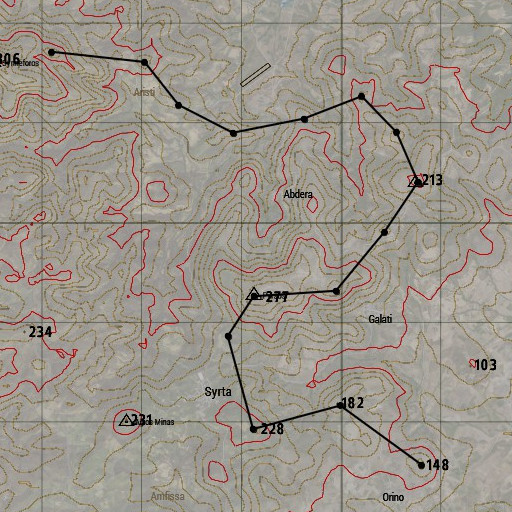
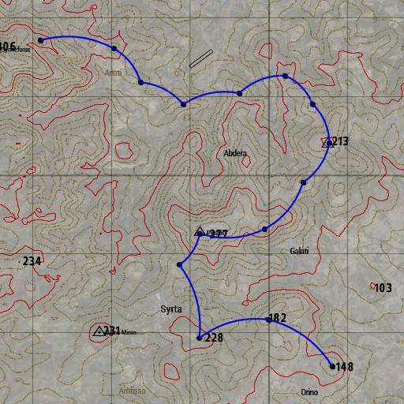
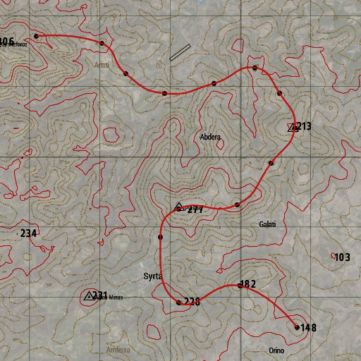
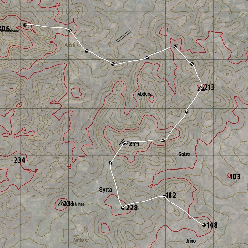
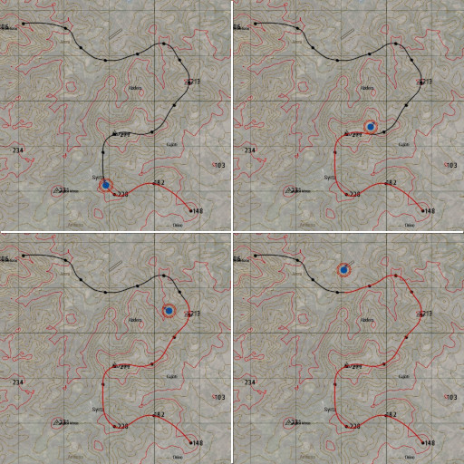

# Basic usage

## Draw straight path

### Example



```sqf
[
    call Foley_markers_fnc_generateExamplePoints,
    "ColorBlack"
] call Foley_markers_fnc_drawStraightPath;
```

### Syntax

[points, color] call **Foley_markers_fnc_drawStraightPath**

### Parameters

* points: Array - an array containing 2D/3D positions, marker names or objects
* color: String - marker color according to [CfgMarkerColors](https://community.bistudio.com/wiki/Arma_3:_CfgMarkerColors)

## Draw curved hops



### Example

```sqf
[
	call Foley_markers_fnc_generateExamplePoints,
	"ColorBlue"
] call Foley_markers_fnc_drawHops; 
```

### Syntax

[points, color, curvature, tweensCount, curveDirection] call **Foley_markers_fnc_drawHops**

### Parameters

* points: Array - an array containing 2D/3D positions, marker names or objects
* color: String - marker color according to [CfgMarkerColors](https://community.bistudio.com/wiki/Arma_3:_CfgMarkerColors)
* curvature: Number - (Optional, default `1.0`) determines how curved the lines are (`0.0` - `1.0`)
* tweensCount: Number - (Optional, default `10`) determines how smooth the curve is
* curveDirection: String - (Optional, default `"RIGHT"`) one of: `"LEFT"`, `"RIGHT"`, `"ALTERNATING"`


## Draw smooth path

### Example



```sqf
[
	call Foley_markers_fnc_generateExamplePoints,
	"ColorRed"
] call Foley_markers_fnc_drawSmoothPath;
```

### Syntax

[points, color, curvature, tweensCount] call **Foley_markers_fnc_drawSmoothPath**

### Parameters

* points: Array - an array containing 2D/3D positions, marker names or objects
* color: String - marker color according to [CfgMarkerColors](https://community.bistudio.com/wiki/Arma_3:_CfgMarkerColors)
* curvature: Number - (Optional, default `1.0`) determines how curved the lines are (`0.0` - `1.0`)
* tweensCount: Number - (Optional, default `10`) determines how smooth the curve is

## Draw wavy path

### Examples



```sqf
[
	call Foley_markers_fnc_generateExamplePoints,
	"ColorWhite"
] call Foley_markers_fnc_drawWavyPath;
```

### Syntax

[points, color, strength, curvesCount, tweensCount] call **Foley_markers_fnc_drawWavyPath**

### Parameters

* points: Array - an array containing 2D/3D positions, marker names or objects
* color: String - marker color according to [CfgMarkerColors](https://community.bistudio.com/wiki/Arma_3:_CfgMarkerColors)
* strength: Array - (Optional, default `[0.3, 0.4, 0.5]`) determines wave strength [min, mean, max]
* curvesCount: Number - (Optional, default `3`) determines how frequently path changes direction
* tweensCount: Number - (Optional, default `10`) determines how smooth the curve is


## Track position along the path

### Example



```sqf
[
	call Foley_markers_fnc_generateExamplePoints,
	"ColorBlack",
	"ColorRed",
	player
] call Foley_markers_fnc_drawPathAndTrackProgress;
```

### Syntax

[points, color, highlightColor, object, gridMode, interval, accuracy] call **Foley_markers_fnc_drawPathAndTrackProgress**

### Parameters

* points: Array - an array containing 2D/3D positions, marker names or objects
* color: String - initial marker color according to [CfgMarkerColors](https://community.bistudio.com/wiki/Arma_3:_CfgMarkerColors)
* highlightColor: String - marker color denoting current position of tracked object
* object: Object - object to be tracked
* gridMode: Boolean - (Optional, default `false`) if true, line segment within current grid will be highlighted, otherwise all segments from the start
* interval: Number - (Optional, default `1`) time in seconds between marker updates
* accuracy: Number - (Optional, default `100`) determines tracking accuracy in meters

## See also

* [Quick start](../README.md)
* [Advanced usage](./advanced-usage.md)
